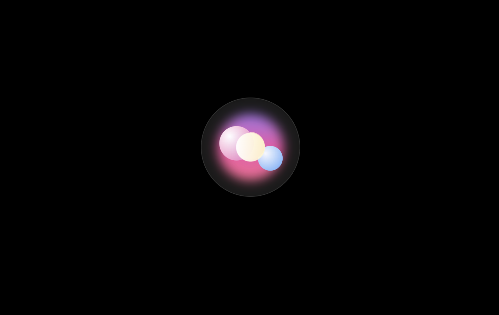

<p align="center">
  
  <br />
  <em>Modern AI-inspired loader in action</em>
</p>

# 🤖 Ai-Buble-Loader

A lightweight, modern, and beautifully animated **React loader** component built for the **AI era**.  
Forget the old *“Thinking…”* or spinning circles — make your users *feel the magic* while they wait.  
Seamlessly integrates with any React + Tailwind project.


> 🧩 `npm i ai-buble-loader` — Drop it in, and let your AI app load with style.

---

## ✨ Why Use Ai-Buble-Loader?

In 2025, everyone is building AI apps — but most still use *90’s-era* spinners and plain “loading…” text.  
The waiting experience is part of your product. **Ai-Buble-Loader** brings your app to life with  
a fun, modern, and *AI-inspired color scheme* that sparks curiosity and engagement.

Instead of making users wonder *“How long will this take?”*,  
make them say *“Wow, this looks cool!”* 🤩

---

## 🚀 Quick Preview

```tsx
import React from "react";
import { AiLoader } from "ai-buble-loader";

export default function App() {
  return (
    <div className="flex justify-center items-center h-screen">
      <AiLoader size="lg" />
    </div>
  );
}
```

---

## ⚡ Key Features

-   🪶 **Lightweight & Modular** — built for fast integration.
    
-   🎨 **AI-Themed Color Palette** — soft gradients & futuristic tones.
    
-   🧩 **Drop-in Replacement** — simply replace your existing loader with `<AiLoader />`.
    
-   ⚙️ **Configurable Sizes** — supports `sm`, `md`, `lg`, `xl`, and `xxl`.
    
-   💫 **Powered by Framer Motion** — smooth, fluid animations.
    
-   💅 **Tailwind Ready** — works perfectly in Tailwind environments.
    
-   🧠 **Perfect for AI Apps** — elevate your UX in seconds.

-   ✅ **Fully TypeScript Supported** — ships with types out of the box.

---

## 📦 Installation

You’ll need React, TailwindCSS, and Framer Motion set up.

```bash
npm install ai-buble-loader
```

---

## 🧩 Peer Dependencies

Make sure you have these installed in your project:

```bash
npm install tailwindcss framer-motion
```

---

## 🪄 Quick Start Guide

1.  **Import the component:**
    
    ```tsx
    import { AiLoader } from "ai-buble-loader";
    ```
    
2.  **Use it anywhere:**
    
    ```tsx
    <AiLoader size="md" />
    ```
    
3.  **Available Sizes:**
    
    | Size | Description |
    | --- | --- |
    | `sm` | Small loader |
    | `md` | Medium (default) |
    | `lg` | Large |
    | `xl` | Extra large |
    | `xxl` | Biggest, for full-page loaders |
    
4.  **Customization Example:**
    
    ```tsx
    <div className="flex flex-col gap-6 items-center justify-center h-screen">   <AiLoader size="sm" />   <AiLoader size="md" />   <AiLoader size="xl" /> </div>
    ```

---

> ⚠️ **Note:** This component uses Tailwind classes.  
> Ensure your project is configured with TailwindCSS before using Ai-Buble-Loader.

---

## 💡 Why You’ll Love It

-   Perfect for **AI dashboards**, **chat UIs**, **wait states**, and **loading screens**.
    
-   Designed to match **modern product aesthetics** — clean, minimal, and futuristic.
    
-   Creates a sense of **motion and thought**, ideal for conversational or AI-driven apps.
    
-   No setup fuss — just plug and play.

<details> <summary>🤔 Why Not To Use It?</summary> <br/> - If you **don’t use TailwindCSS**, you’ll need to adjust styles manually. - It’s currently **version 1**, so advanced customization and theming will come in future updates. - You prefer a static or minimalist loading indicator without animation. </details>

---

## 🧭 Roadmap (v2 Coming Soon)

   -   🌈 Color themes (Dark / Light / Gradient)

   -   ⚙️ Prop-based animation speed control
        
   -   🔄 Custom message or text overlay
        
   -   🧩 Integration presets for Next.js / Vite
        
   -   🎨 Custom Tailwind plugin support   
    
---

## 🧠 Project Philosophy

> _Don’t let your users feel they’re waiting — let them feel they’re watching something smart._


---

## 📄 License

This project is licensed under the **MIT License** — free for personal and commercial use.

---

## 🌍 Connect

- 🧑‍💻 [GitHub Repository](https://github.com/garvitthakral)
- 🐦 [Follow on X (Twitter)](https://x.com/thakral_garvit)
- 💌 [Check out Linkedin](https://www.linkedin.com/in/garvit-thakral-23a0a130a/)
- 🌐 [NPM Package](https://www.npmjs.com/package/ai-buble-loader)

If you use this loader, share a screenshot or tag **#AiBubleLoader** —  
we’d love to see how you’re redefining waiting experiences in the **AI era** ⚡

---

**Made with 💙 and Framer Motion.** 
—  _Ai-Buble-Loader Team_
